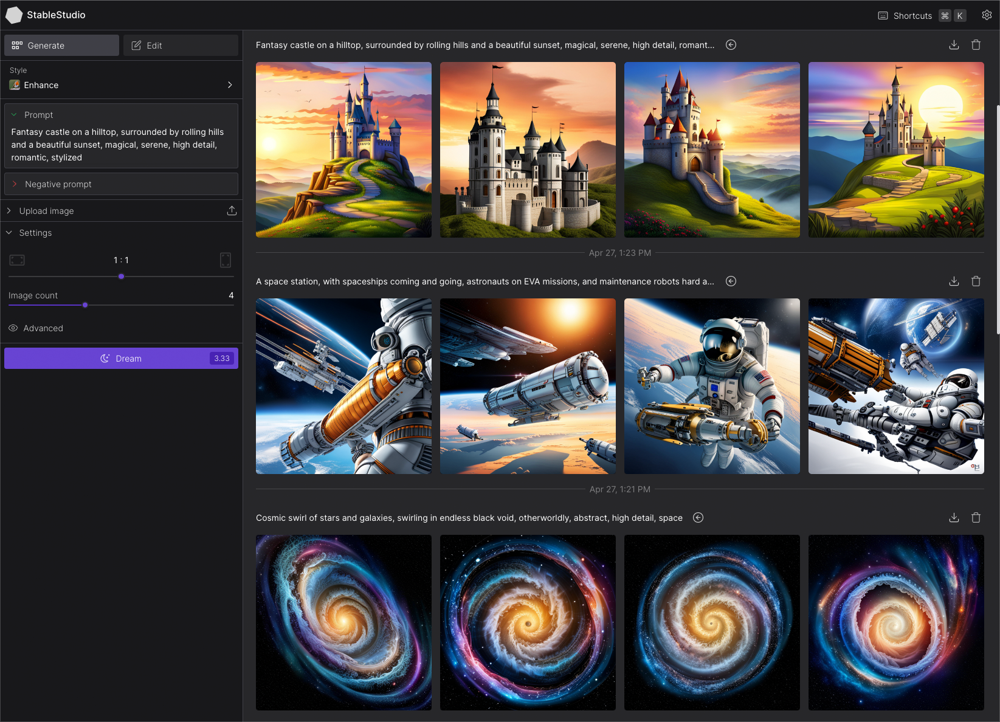
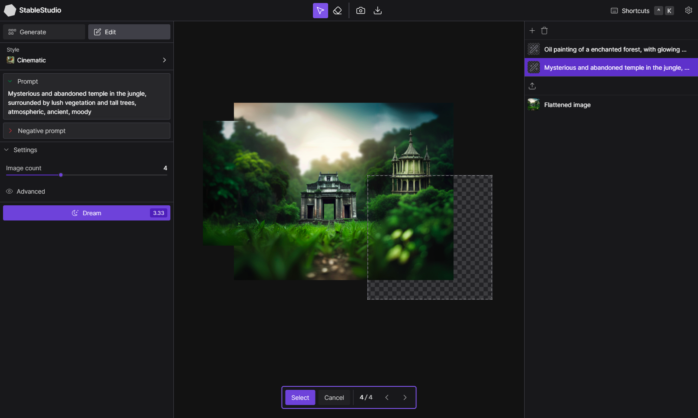

<div align="center">


# StableStudio by [Stability AI](https://stability.ai/)

**👋 Welcome to the community repository for StableStudio, the open-source version of [DreamStudio](https://www.dreamstudio.ai)**

**🗺 Contents – [🚀 Quick Start](#quick-start) · [ℹ️ About](#about) · [🙋 FAQ](#faq) · [🧑‍💻 Contributing](#contributing)**

**📚 Documentation – [🎨 UI](./packages/stablestudio-ui/README.md) · [🔌 Plugins](./packages/stablestudio-plugin/README.md) · <a href="https://platform.stability.ai" target="_blank">⚡️ platform.stability.ai</a>**

**🔗 Links – <a href="https://discord.com/channels/1002292111942635562/1108055793674227782" target="_blank">🎮 Discord</a> · <a href="https://dreamstudio.ai" target="_blank">🌈 DreamStudio</a> · <a href="https://github.com/Stability-AI/StableStudio/issues">🛟 Bugs & Support</a> · <a href="https://github.com/Stability-AI/StableStudio/discussions">💬 Discussion</a>**

</div>

<div align="center" style="display: flex; flex-wrap: wrap; justify-content: center; align-items: center; gap: 1em; margin: 4em 0;">
  
  
</div>

# <a id="quick-start" href="#quick-start">🚀 Quick Start</a>

You'll need to have [Node.js](https://nodejs.org/en/) and [Yarn](https://yarnpkg.com/) installed.

Once that's done, you can run the following commands...

```bash
git clone https://github.com/Stability-AI/StableStudio.git

cd StableStudio

yarn

yarn dev
```

_**That's it! 🎉**_

StableStudio will be running at [localhost:3000](http://localhost:3000) by default.

You'll need to have your [API key](https://platform.stability.ai/docs/getting-started/authentication) handy to use the default [Stability API](https://platform.stability.ai/docs/getting-started) plugin.

If you don't have one, you can create an account on [DreamStudio](https://dreamstudio.ai) and get a key from the [account page](https://dreamstudio.ai/account).

# <a id="about" href="#about">ℹ️ About</a>

<div style="display: flex; justify-content: center; align-items: center; gap: 1em; margin: 0 0 2em 0;">
  
</div>

StableStudio is [Stability AI](https://stability.ai)'s official open-source variant of [DreamStudio](https://www.dreamstudio.ai), our user interface for generative AI.

It is a web-based application that allows users to create and edit generated images.

We're not entirely sure where this project is going just yet, but we're excited to see what the community does with it!

# <a id="faq" href="#faq">🙋 FAQ</a>

## What's the difference between StableStudio and [DreamStudio](https://dreamstudio.ai)?

_Not much!_ There are a few tweaks we made to make the project more community-friendly:

- We removed [DreamStudio](https://dreamstudio.ai)-specific branding.

- All "over-the-wire" API calls have been replaced by a [plugin system](./packages/stablestudio-plugin/README.md) which allows you to easily swap out the back-end.

  - On release, we'll only be providing a plugin for the Stability API, but with a little bit of TypeScript, you can [create your own](./packages/stablestudio-plugin/README.md).

- We removed Stability-specific account features such as billing, API key management, etc.

  - These features are still available at [DreamStudio's account page](https://dreamstudio.ai/account).

## Will [DreamStudio](https://dreamstudio.ai) still be supported?

_Yes!_ Stability's hosted deployment of StableStudio will remain [DreamStudio](https://dreamstudio.ai).

It will continue to get updates and stay up-to-date with StableStudio whenever possible.

# <a id="contributing" href="#contributing">🧑‍💻 Contributing</a>

<div style="display: flex; justify-content: center; align-items: center; gap: 1em; margin: 0 0 2em 0;">
  
</div>

_**Community contributions are encouraged!**_

_**The UI package's [README](./packages/stablestudio-ui/README.md) is a great place to start.**_

Bug fixes, documentation, general clean-up, new features, etc. are all welcome.

Here are some useful links...

- [Discussion](https://github.com/Stability-AI/StableStudio/discussions)
- [Open Issues](https://github.com/Stability-AI/StableStudio/issues)
- [Open Pull Requests](https://github.com/Stability-AI/StableStudio/pulls)
- [Code of Conduct](./CODE_OF_CONDUCT.md)
