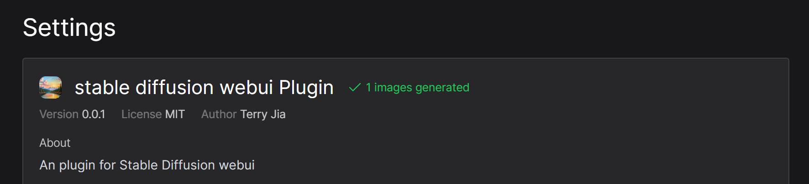

This is a basic implement for stable-diffusion-webui plugin.

# How to use
1. On stable-diffusion-webui side, edit webui-user.bat and  
`set COMMANDLINE_ARGS=--nowebui --cors-allow-origins=http://localhost:3000`  
Then start your webui.
2. Once you see **INFO:     Uvicorn running on http://127.0.0.1:7861**, means you started webui on api mode successfully.
you can open http://127.0.0.1:7861/docs to double check.
3. On StableStudio side, run `yarn dev:use-webui-plugin`
4. once the server started, click settings to check this plugin loaded successfully or not. 

5. click **Dream**, your webui server should start to process your request from StableStudio.

Still, currently this plugin is a basic implement for webui, and only support a few of features:
- [x] txt2img
- [x] basic features (prompt, negative prompt, steps, batch_size, image size)
- [x] features provided by StableStudio
- [x] model select
- [x] sampler select
- [x] img2img
- [x] mask/inpaint/outpaint
- [x] store settings
- [x] webui status could replace images generated status
- [ ] upscale (working)
- [ ] Lora support 
- [ ] load existing images
- [ ] plugin could use path in settings along with a field for extra cli flags to launch webui on startup
- [ ] some bugs fix
- [ ] MacOS and Linux support (since I don’t have environment with MacOS/Linux, may need someone help with this)
- [ ] Need to think about how to deal with extensions ecosystem in webui
- [ ] many other features from webui...