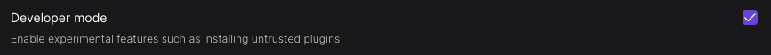
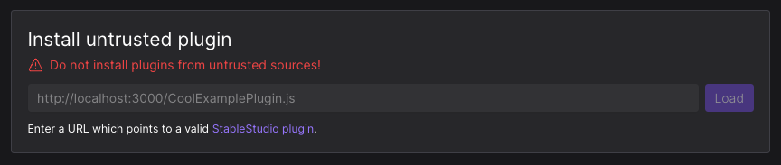
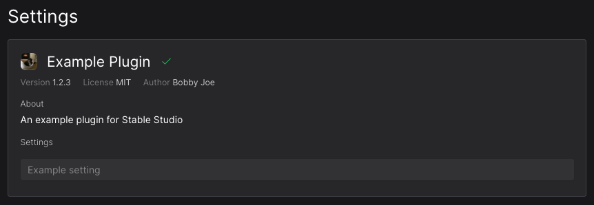

<div align="center">

# 🔌 Plugins

**🗺 Contents – [ℹ️ About](#about) · [📦 Installation](#installation) · [🤝 Contract](#technology) · [🔮 Future](#conventions)**

**[⬆️ Top-Level README](../../README.md)**


### 🚧 👷 **PLUGINS ARE EXPERIMENTAL AND NOT FINAL** 🛠 🚧

_The contract and implementation are [likely to change](https://github.com/Stability-AI/StableStudio/issues/3)..._

</div>

# <a id="about" href="#about">ℹ️ About</a>

In order to make StableStudio easier to extend, we've ripped out the "back-end" into a plugin system.

This means you can implement an entirely different inference stack, StableStudio doesn't care if it's local or a hosted API.

## ⭐️ First-Party Plugins

There are currently three first-party plugins which are maintained in this repository:

- [`stablestudio-plugin-stability`](../stablestudio-plugin-stability/src/index.ts) – The default plugin which uses [Stability's API](https://platform.stability.ai) for inference.

  ```bash
  yarn dev
  ```

- [`stablestudio-plugin-webui`](../stablestudio-plugin-webui/README.md) – This plugin uses [`stable-diffusion-webui`](https://github.com/AUTOMATIC1111/stable-diffusion-webui) for inference.

  ```bash
  yarn dev:use-webui-plugin
  ```

We are still figuring out a more scalable strategy for third-party plugins, [let us know what you think](https://github.com/Stability-AI/StableStudio/issues/3)!

## ⚡️ Features

We're hoping this list expands [over time](#future), but here's what's available right now...

- **🏞 Image Generation**

  All aspects of image generation are handled by plugins including the default input, how styles are implemented, how to fetch existing images, etc.

- **🪪 Plugin Manifest**

  Plugins can provide a manifest with a markdown description, author details, version information, etc.

- **⚙️ Plugin Settings**

  Plugins can declare settings which are available to the user in the settings menu.

## 🧪 Development

**If you want to play around with an example plugin which has nice developer tooling, check out the [example plugin](../stablestudio-plugin-example/src/index.ts).**

You can load the UI using example plugin instead of the default [Stability plugin](../stablestudio-plugin-stability/src/index.ts) by running...

```bash
yarn dev:use-example-plugin
```

Any changes you make within the [example plugin](../stablestudio-plugin-example/src/index.ts) will be hot-reloaded into StableStudio.

# <a id="installation" href="#installation">📦 Installation</a>

**This is mainly a feature intended for developers, we're [likely to change](https://github.com/Stability-AI/StableStudio/issues/3) how plugins work for end-users.**

_Never install plugins from untrusted sources!_

Although they are sand-boxed to the browser, a malicious actor could read through your image history or steal your API key if you're not careful.

To install a plugin, first enable "developer mode" in the settings menu...



Now you can point to any fetch-able JavaScript file which exports a plugin...



If loaded successfully, you'll see it in the settings menu...



✅ _**That's it!**_

As of now, you can only have one active plugin at a time.

The main purpose of plugins in their current form is to allow developers to experiment with different inference stacks.

# <a id="contract" href="#contract">🤝 Contract</a>

**Check out the [TypeScript source](./src/Plugin.ts) to see full documentation of the API.**

Plugins are effectively just a bag of JavaScript functions.

StableStudio calls these functions for core functionality, such as `createStableDiffusionImages`, `getStableDiffusionStyles`, `getStableDiffusionDefaultInput`, etc.

Functionality degrades gracefully, for example, if you don't implement `getStableDiffusionStyles`, no styles will be shown in the UI.

# <a id="future" href="#future">🔮 Future</a>

Plugins were mostly created to rip out calls to Stability's [gRPC API](https://platform.stability.ai), so their functionality is quite limited.

**Given the importance of a robust plugin system, we're really hoping to [gather feedback](https://github.com/Stability-AI/StableStudio/issues/3) on how we can improve the API.**

Here's what's on our mind when it comes to the future of StableStudio plugins...

- **🧠 More Inference Stacks**

  The default [Stability plugin](../stablestudio-plugin-stability/src/index.ts) enables inference relying on [Stability's API](../stablestudio-plugin-stability/src/index.ts), but we're hoping to expand support for local inference.

  We're particularly interested in creating a plugin for using [`stable-diffusion-webui`](https://github.com/AUTOMATIC1111/stable-diffusion-webui)'s [REST API](https://github.com/AUTOMATIC1111/stable-diffusion-webui/wiki/API).

  Though it's not fully-ready, we're excited about the future of [WebGPU](https://developer.mozilla.org/en-US/docs/Web/API/WebGPU_API), and would love to support it via a plugin.

  _We've stubbed out two empty packages to house these potential plugins..._

  [`stablestudio-plugin-webui`](../stablestudio-plugin-webui/src/index.ts)

  [`stablestudio-plugin-webgpu`](../stablestudio-plugin-webgpu/src/index.ts)

- **🎨 Deeper UI Extensibility**

  Currently plugins can only change "back-end" functionality. We'd love to allow plugins to create entire new features or modify existing ones.

- **🧱 Multiple Plugins**

  Only one plugin can be loaded at a time with our current implementation. Allowing multiple plugins to play nicely with each other would be a huge win.

- **🛍 Plugin Library**

  If there is enough interest and community momentum, we'd love to create a plugin library where users can easily install plugins from a curated list.
