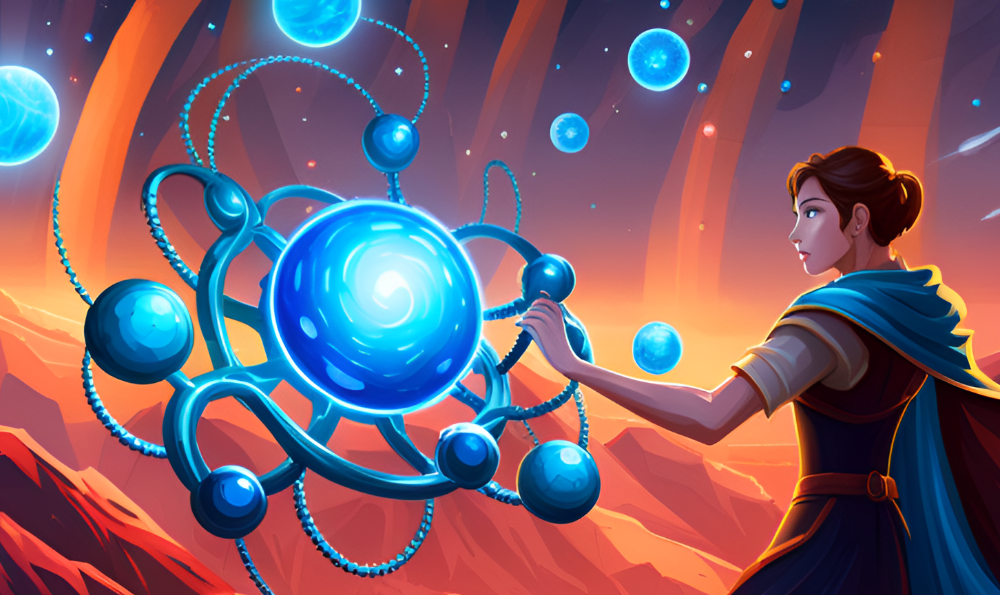

<div align="center">

# 🎨 UI

**🗺 Contents – [ℹ️ About](#about) · [🦾 Technology](#technology) · [🏗 Structure](#structure) · [🤝 Conventions](#conventions)**

**[⬆️ Top-Level README](../../README.md)**


</div>

# <a id="about" href="#about">ℹ️ About</a>

_Welcome to the UI package for StableStudio!_

**If you're ready to dive in and make changes, be sure to read about [technology](#technology), [structure](#structure), [conventions](#conventions), and [plugins](../stablestudio-plugin/README.md) first.**

## 📜 History

StableStudio represents a new direction for [DreamStudio](https://dreamstudio.ai) with renewed focus on open-source and community-driven development, but the project has an interesting backstory...

- **Pre-Stable Diffusion Launch**

  _Summer 2022_

  [DreamStudio](https://dreamstudio.ai) began as passion-project by [@nin](https://twitter.com/nin_artificial) with the goal of creating an all-in-one creative studio for generative animations using Disco Diffusion. He and several other collaborators wrote the original UI using Vue.js and a local Python back-end. With the imminent arrival of Stable Diffusion, focus shifted toward creating an easy-to-use interface for image generation so the release of the model would be as accessible as possible.

- **Post-Stable Diffusion Launch**

  _August 2022 – November 2022_

  Following the release of Stable Diffusion, [DreamStudio](https://dreamstudio.ai) served as a vehicle for new models and features shipped by [Stability AI](http://stability.ai). This period saw the introduction of [in-painting](https://platform.stability.ai/docs/features/inpainting?tab=typescript), [out-painting](https://platform.stability.ai/docs/features/inpainting?tab=typescript), and [image-to-image](https://platform.stability.ai/docs/features/image-to-image?tab=typescript).

- **React**

  _December 2022 – April 2023_

  In early December, work began on a new infinite-canvas version of the existing editor. Given the need to manage complicated state and side effects declaratively, the decision was made to switch the editor to React. Once a working editor MVP was finished, the opportunity was taken to rewrite the entire app while also shipping a re-imagined UX.

- **StableStudio**

  _Present – Future_

  The breakneck speed of the Stable Diffusion community has proven distributing generative AI is better achieved through open-source development. We're hopeful StableStudio can serve as a hub for community collaboration and a home for exciting new features.

# <a id="technology" href="#technology">🦾 Technology</a>



- **[TypeScript](https://www.typescriptlang.org/)** – Type safety ftw!

- **[Vite](https://vitejs.dev/)** – Bundler and live-development tool. You can see the full config in [`vite.config.ts`](./vite.config.ts)

- **[React](https://reactjs.org/)** –  We're using React with modern hooks and functional components

- **[Zustand](https://docs.pmnd.rs/zustand/getting-started/introduction)** –  Extremely fast and easy-to-use state management, it's powerful and tiny!

- **[Tailwind](https://tailwindcss.com/)** – Our preferred method of styling components, the config is at [`tailwind.config.js`](./tailwind.config.cjs)

- **[Emotion](https://emotion.sh/docs/introduction)** – For when we need to break free of Tailwind and write "native CSS"

# <a id="structure" href="#structure">🏗 Structure</a>


## 🧱 Domain-Driven Design

**The most important aspect of this codebase's structure is adherence to domain-driven design.**

This means we organize code around the _concepts_ rather than technical implementation details.

For example, if we identify a _concept_, let's say `User`, we would create a `User` "domain."

The `User` domain would _own_ all user-related code, including visual representation, state, hooks, etc.

Most domains are _composed_ of smaller domains; a hypothetical `User` domain might be composed of `User.State`, `User.Avatar`, `User.Preferences`, `User.Details`, etc.

_This structure is fractal in nature,_ meaning `User.Details` might itself be composed of `User.Details.SocialMedia`, `User.Details.ContactInformation`, `User.Details.UpdateRequest`, etc.

### \*️⃣ Domain Syntax

Here's an example of how we might represent a `User` domain in code...

```tsx
import { Avatar } from "./Avatar";
import { Preferences } from "./Preferences";
import { Details } from "./Details";

export type User = {
  id: ID;
  avatar?: User.Avatar;
  preferences?: User.Preferences;
  details?: User.Details;
};

export function User({ id }: User.Props) {
  const user = User.use(id);
  return (
    <>
      <User.Avatar avatar={avatar} />
      <User.Preferences preferences={preferences} />
      <User.Details details={details} />
    </>
  );
}

export declare namespace User {
  export { Avatar, Preferences, Details };
}

export namespace User {
  User.Avatar = Avatar;
  User.Preferences = Preferences;
  User.Details = Details;

  export type Props = {
    id?: ID;
  };

  export const use = (id: ID) => {
    // Make an API call for the user or something
  };
}
```

This syntax takes advantage of TypeScript's declaration merging feature to enable nice fluent-style APIs for domains...

```tsx
import { User } from "./User";

// You can use `User` as a type

const bob: User = { id: "bob" };

function App(id: ID) {
  // You can use `User` as a namespace

  const user = User.use(id);
  const userPreferences = User.Preferences.use(id);

  // You can use `User` as a component

  return (
    <>
      <User id={user.id} />
      <User.Preferences id={user.id} />
    </>
  );
}
```

Here is an example of a real domain ([`Editor.Camera`](./src/Editor/Camera/index.tsx)) you'll find in the app...

```tsx
// Owner of all things camera-related in the editor
Editor.Camera;

// Centers the camera in the editor
Editor.Camera.Center;

// The hand tool is used for panning around
Editor.Camera.Hand;

// For resetting the camera to the default view
Editor.Camera.Reset;

// Specifies keyboard shortcuts for camera actions
Editor.Camera.Shortcuts;

// Controls the zoom level of the camera and mouse wheel controls
Editor.Camera.Zoom;
```

Quick note about the `export declare namespace User` syntax from the first example...

This is needed when a namespace exports a type.

It's an unfortunate bit of syntax which might [not be needed](https://github.com/microsoft/TypeScript/issues/39865) in the future.

If you want to discuss this further, please check out [this issue](https://github.com/Stability-AI/StableStudio/issues/7).

### 📁 Directories and Files

_Domains are usually correlated one-to-one with file/folder structure._

For example, the [`Editor.Camera`](./src/Editor/Camera/index.tsx) domain mentioned above is composed of the following files...

```
./src/Editor/Camera/
├── Center.tsx
├── Hand.tsx
├── Reset.tsx
├── Shortcut.tsx
├── Zoom.tsx
└── index.tsx
```

This means if you see a domain like [`Generation.Image.Download`](./src/Generation/Image/Download/index.tsx), you can expect to find it at `./src/Generation/Image/Download`.

All root-level domains located at the top-level of the [`./src`](./src) folder and can be imported using the shorthand syntax...

```ts
import { ExampleDomain } from "~/ExampleDomain";

import { ExampleDomain } from "../../../../../ExampleDomain";
// ^ If you were deep in the folder tree, it would look like this without the `~` alias
```

### 📋 Structuring Tips

- **Look for repeated references to a word or concept**

  For example, if you're working in a `User` domain and find yourself using the word "avatar" a lot, you might want to create a `User.Avatar` domain

- **Compound words are structuring hints**

  Domains like `DeviceInformation` might be better represented as `Device.Information`.

- **Plural domains are very important**

  The singular [`Generation.Image.Input`](./src/Generation/Image/Input/index.tsx) domain owns everything related to the concept of what's being fed to an image generation, but [`Generation.Image.Inputs`](./src/Generation/Image/index.tsx) owns the state of all inputs as a collective.

  Plural domains are usually exported at the same level as their singular counterparts, such as [`Editor.Dream`](./src/Editor/Dream/index.tsx) and [`Editor.Dreams`](./src/Editor/Dream/Dreams.tsx).

### ⭐️ Important Domains

- **[`App`](./src/App/index.tsx)** – Owner of app-level functionality such as the React root, sidebars, providers, etc.

- **[`Generation.Image`](./src/Generation/Image/index.tsx)** – Likely the largest domain, owns all things related to image generation
- **[`Generation.Image.Session`](./src/Generation/Image/Session/index.tsx)** – Domain which was poorly named and grew too large as a result, manages the active "image generation session"
- **[`Editor`](./src/GlobalVariables/index.tsd)** – Home of all editor functionality
- **[`Plugin`](./src/Plugin/index.ts)** – Owner of plugin setup and access, contains the important `Plugin.use` hook
- **[`Theme`](./src/Theme/index.ts)** – Contains the StableStudio's design system and common components such as `Theme.Icon`, `Theme.Button`, etc.
- **[`Shortcut`](./src/Shortcut/index.ts)** – Contains the StableStudio's keyboard shortcut system and menu
- **[`GlobalState`](./src/GlobalState/index.ts)** – Mostly a pass-through wrapper around [Zustand](https://docs.pmnd.rs/zustand/getting-started/introduction)
- <span id="global-variables">**[`GlobalVariables`](./src/GlobalVariables/index.ts)**</span> – Extremely useful functions and types available across the StableStudio without needing any imports (`css`, `classes`, `useEffect`, etc.)

# <a id="conventions" href="#conventions">🤝 Conventions</a>


## 💅 Styles and CSS

Most styling in StableStudio is implemented with [Tailwind CSS](https://tailwindcss.com/).

The [`Theme`](./src/Theme/index.ts) domain contains a bunch of useful pre-made components, make sure to check there first if you need something "off-the-shelf."

You can use the [`classes`](#global-variables) function anywhere without imports if you need conditional styling or to break apart class names...

```tsx
function Example({
  isEmphasized,
  isDisabled,
  children,
}: PropsWithChildren<{
  isEmphasized?: boolean;
  isDisabled: boolean;
}>) {
  return (
    <div
      className={classes(
        "bg-gray-100",
        isEmphasized && "bg-red-500 text-4xl font-bold",
        isDisabled && "text-xs opacity-50"
      )}
    >
      {children}
    </div>
  );
}
```

You can always "break glass" and use raw CSS via the globally-available `css` function if you need to, but please try to avoid it...

```tsx
function Example() {
  return (
    <div
      css={css`
        ::-webkit-scrollbar {
          display: none;
        }
      `}
    >
      Hello, World!
    </div>
  );
}
```

## 🏛 State Management via [Zustand](https://docs.pmnd.rs/zustand/getting-started/introduction)

StableStudio uses [Zustand](https://docs.pmnd.rs/zustand/getting-started/introduction) for state management, which is honestly super cool.

It's fast and small, you can read through the whole codebase in a few minutes.

We originally used [Recoil](https://recoiljs.org/) it couldn't handle "hot" paths nearly as well.

Whenever you need globally-available state, you can use the [`GlobalState`](./src/GlobalState/index.ts) domain, which wraps Zustand...

```tsx
import { GlobalState } from "~/GlobalState";

function Count() {
  const count = Count.use();
  const setCount = Count.useSet();
  return (
    <div>
      <button onClick={() => setCount(count + 1)}>Increment</button>
      <span>{count}</span>
    </div>
  );
}

export namespace Count {
  export const use = State.use(({ count }) => count);
  export const useSet = () =>
    State.use(({ setCount }) => setCount, GlobalState.shallow);
}

type State = {
  count: number;
  setCount: (count: number) => void;
};

namespace State {
  const store = GlobalState.create<State>((set) => ({
    count: 0,
    setCount: (count) => set({ count }),
  }));

  export const use = store;
}
```

Notice how the `Count` domain exports `Count.use` and `Count.useSet` instead of exporting its state directly.

This allows us to change the state implementation without breaking any code that uses it.

Finally, you can see `GlobalState.shallow` used to [limit rerenders](https://github.com/pmndrs/zustand#selecting-multiple-state-slices).
